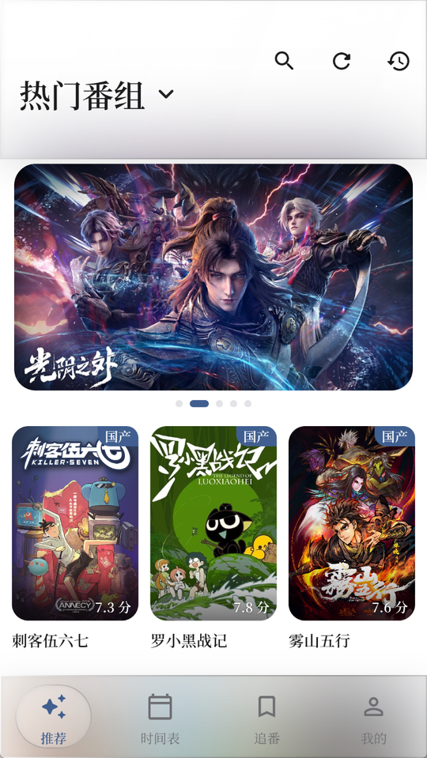
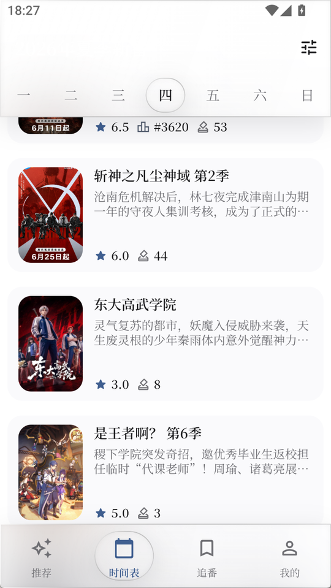
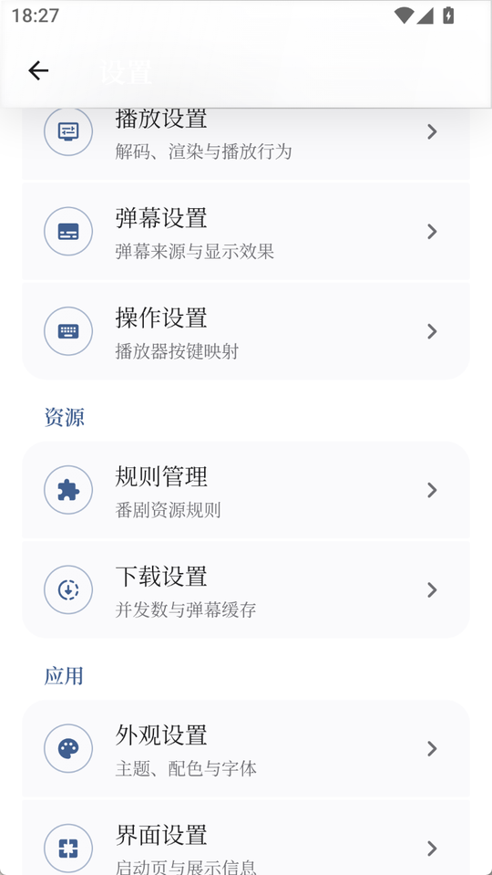
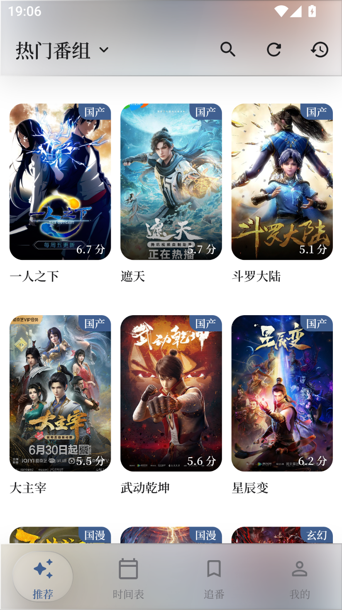
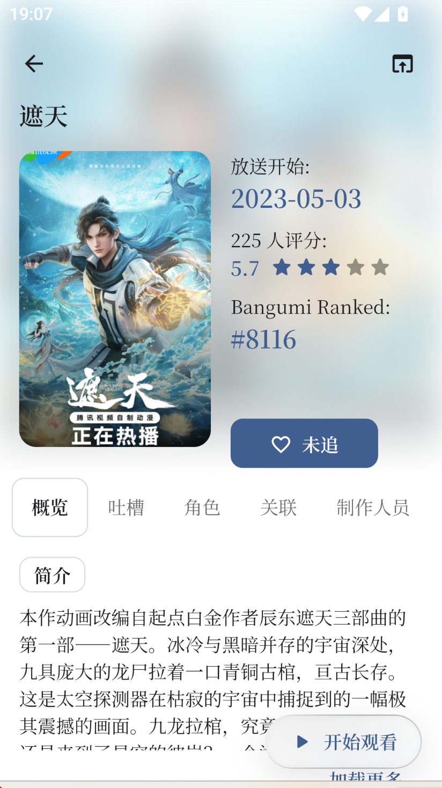
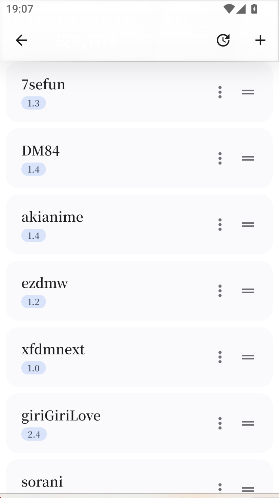
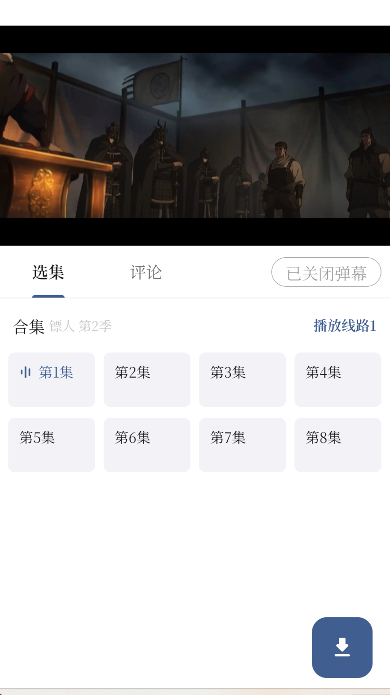
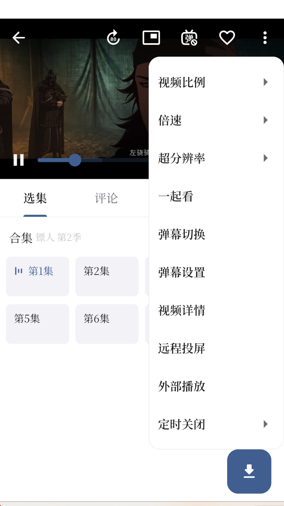
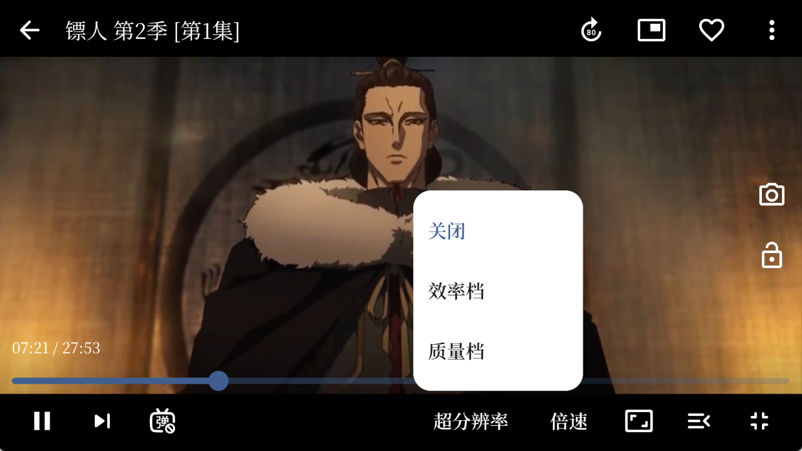

<div align="center">

</img>

# Miru

**面向国漫用户的 Kazumi 修改版 · 仅 Android**

</img>
</img>
</img>

[**⬇ 下载最新版本**](https://github.com/DisenthrallClaude/Miru/releases/latest)

</div>

---

## 这是什么

Miru 基于开源项目 [Kazumi](https://github.com/Predidit/Kazumi) 修改而来。

原项目是一个通用的番剧采集与在线观看程序。Miru 在它的基础上做了两件事：**把内容面向国漫收敛**，以及**把界面整个重做一遍**。

**只提供 Android 版本。** 本仓库已移除 iOS、Web、Windows、Linux、macOS 等其他平台的源码与构建配置，仅保留 Android 相关的内容，不再提供其他平台的构建。

## 截图

<div align="center">
<b>首页 · 时间表 · 设置</b><br/>
</img>
&nbsp;
</img>
&nbsp;
</img>
</div>

<div align="center">
<b>实拍 · 推荐页 · 番剧详情 · 播放源规则管理</b><br/>
</img>
&nbsp;
</img>
&nbsp;
</img>
</div>

<div align="center">
<b>实拍 · 选集（播放线路）· 播放器菜单</b><br/>
</img>
&nbsp;
</img>
</div>

<div align="center">
<b>实拍 · 播放器（横屏 / 超分辨率）</b><br/>
</img>
</div>

## 改了什么

### 内容：只推国漫

- **推荐页与时间表按产地标签过滤**，只出国产动画，不再混入日番。想切回去只需改 `ApiEndpoints.bangumiRegionTag` 一个常量。
- **首页顶部固定横幅**，用内置的 16:9 官方主视觉图，不再拿竖版海报硬裁成横图。
- **置顶片单**：指定的国漫排在推荐流最前，顺序可在 `lib/request/config/featured_bangumi.dart` 里调整。

### 网络：解决国内直连不通

Bangumi 官方 API 在中国大陆无法直连。原项目通过自建 mirror 解决，但那个 mirror 需要签名密钥，**自建包拿不到密钥，会导致搜索、评论、热门、时间表全部失效**。

Miru 改用无需鉴权的社区公共反代：

| 官方域名 | 反代 |
| --- | --- |
| `api.bgm.tv` | `bgmapi.anibt.net` |
| `next.bgm.tv` | `next.bangumi.lol` |

> ⚠️ 这两个反代是社区个人维护的公共服务，可能限流或停服。真出问题时，改 `lib/request/config/api_endpoints.dart` 里的域名常量即可切换。

### 界面：重做

- **衬线排印**：全局使用思源宋体（Noto Serif SC），中英文统一。
- **液态玻璃材质**：导航条、顶栏、弹窗、选中态。页签滑块由弹簧模拟驱动，并按实时速度做拉伸压扁。
- **中性化配色**：参考 iOS 的表面色阶体系，强调色只出现在交互元素上，不铺满背景。
- **首页版式**：大横幅轮播 + 竖版海报网格。

### 体验

- **首启自动装规则**：不必再逐条点「安装」。
- **推荐页与时间表本地持久化**：加载一次后，之后启动直接读本地；缓存过期会后台静默刷新，失败时旧数据还在。
- **播放源平铺**：选播放源时直接列出所有搜到的结果，不用先选来源再选结果。
- **解析失败自动换线路**：当前线路打不开时自动试下一条，失败页也提供「重试 / 换线路 / 返回换源」。
- **自定义弹幕接口**：可填兼容弹弹play 协议的自建服务，不必死等官方密钥。

## 安装

1. 到 [Releases](https://github.com/DisenthrallClaude/Miru/releases/latest) 下载 `Miru-android.apk`
2. 安装（首次需允许「安装未知来源应用」）
3. 首启跟着引导走完，规则会自动装好

**要求 Android 10 及以上。** APK 内含 `arm64-v8a` / `armeabi-v7a` / `x86_64` 三种架构，绝大多数机型可直接安装。

## 已知问题

**本项目仍有大量 bug 和待优化之处，不是成熟产品。** 已知的有：

- **官方弹幕默认不可用**。弹幕依赖弹弹play 的签名密钥，自建包拿不到。可在「设置 → 弹幕设置 → 自定义弹幕接口」填一个兼容弹弹play `/api/v2` 的服务（例如自建 [danmu_api](https://github.com/huangxd-/danmu_api)）。
- **部分番剧播放失败**。播放依赖第三方站点的采集规则，站点改版规则就会失效。现在会自动尝试同一集的下一条播放线路；仍失败可点「换一条线路」或返回换源。
- 只在少数机型上测过，兼容性未知。
- 平板竖屏已改用侧栏导航，手机横屏仍自动全屏；更复杂的折叠屏适配还没做。

## 常见问题与解决方法

Miru 继承自 [Kazumi](https://github.com/Predidit/Kazumi)，很多麻烦其实来自「规则 / 播放源」这套第三方生态，而不是 App 本身。站点一改版、规则一失效，就会出现「某部番放不了」。遇到时按下面的顺序排查：

### 播放失败 / 提示「播放器内部错误」

1. **多刷新几遍。** 规则和搜索结果大多是动态拉取的，网络抖动或源临时抽风时，多刷几次往往就能恢复。
2. **切换播放源 / 线路。** 同一部番通常有多个播放源（选集页的「播放线路」），这个源打不开就换下一个，命中率会高很多。
3. **更新或重建规则。** 在「规则」页找到对应站点，删除后重新添加，让 App 重新拉取该站点的最新规则。
4. **自己去找规则配置。** 社区维护的规则合集（Kazumi 生态的规则地址）有很多，在 App 里「添加规则」粘贴规则地址即可接入更多播放源。规则装得越多、可用性越高，一个失效就换另一个。

### 搜索 / 推荐 / 时间表打不开

列表数据走 Bangumi 官方 API 的社区反代（见上文「网络」一节）。反代是个人维护的公共资源，可能限流或停服：

- 先多刷新几遍；应用会自动换下一个反代，最后回落官方接口；
- 推荐页 / 时间表有本地缓存：过期后先展示旧数据再后台刷新，不会一启动就白屏；
- 若长期打不开，去 `lib/request/core/bangumi_proxy_router.dart` 里给对应 host 加一条反代即可。

### 弹幕不显示

1. 打开「设置 → 弹幕设置 → 自定义弹幕接口」；
2. 填入自建的兼容弹弹play 协议地址（不要带 `/api/v2` 也行，应用会自己整理）；
3. 留空则继续走官方接口，自建包通常会失败。

## 反馈

遇到问题或有建议：**zero100610@gmail.com**

## 自行构建

```bash
flutter --version   # 需要 Flutter 3.47.0
flutter pub get
flutter build apk --release
```

产物位于 `build/app/outputs/flutter-apk/app-release.apk`。

> 弹幕与原版 Kazumi 自建 mirror 需要密钥（`DANDANAPI_APPID` / `DANDANAPI_KEY` / `KAZUMI_APPID` / `KAZUMI_KEY`），
> 由原项目 CI 通过 `--dart-define` 注入。自行构建拿不到这些密钥，因此弹幕不可用；
> 搜索与番剧数据已改走公共反代，不受影响。

## 致谢

- 原项目 [Predidit/Kazumi](https://github.com/Predidit/Kazumi) 及其所有贡献者
- 内测用户 **@灯塔上的雾**
- 赞助商 **@小圆猪**

## 开源声明

本项目基于 [Kazumi](https://github.com/Predidit/Kazumi) 修改，遵循原项目的开源许可证（见 [LICENSE](LICENSE)）发布，**不用于商业用途**。原项目版权归原作者所有。

番剧数据来自 [Bangumi 番组计划](https://bangumi.tv/)，播放源由用户自行配置的采集规则提供。本项目不存储、不分发任何影视内容，所有内容均来自用户自行添加的第三方站点。请在下载后 24 小时内删除，勿用于任何商业用途。
